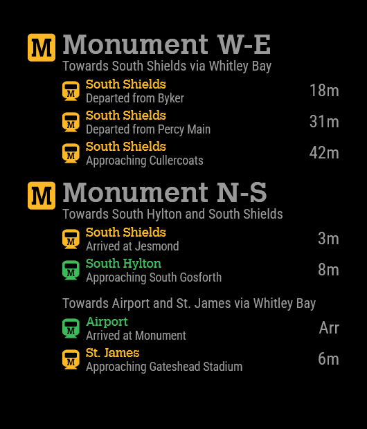

<!--- Copyright (C) 2024 jcktwd -->

# Module: Nexus Metro RTI

The `MMM-NexusMetroRTI` module is compatible with the [MagicMirror²](https://docs.magicmirror.builders/) ([Github Repository](https://github.com/MagicMirrorOrg/MagicMirror)) project and can display live estimates of train arrival times at stations along the Nexus Tyne and Wear Metro, located in the North-East of the UK. It utilised their own undocumented API.

#### Examples




## Requirements and Optional Dependencies

This module utilised a public API which requires no API key. Should this change in the future please report the issue within the Github repository.

You will need to configure the station and platform by using the station codes which listed [`./public/cache/stations.json`](./cache/stations.json) and platform numbers in [`./public/cache/platforms.json`](./cache/platforms.json).

NOTE: These files are used by the module to reduce API calls since the station information is rarely changed. You can update the cached information by setting the config property `updateCacheOnStart: true`.

### Calvert Font

As displayed in the example above, the module can use the Calvert font as is used in branding on the Tyne and Wear Metro. Because of licencing, the font is not included in the repository. This font is available to be licensed by Monotype [here](https://www.myfonts.com/collections/calvert-font-monotype-imaging),  or otherwise available online from sources like [here]("https://fontshub.pro/font/calvert-download"). If you would like to use the font, obtain a copy and save it in `./public/fonts/` with the filename `Calvert-MT` and extension either `ttf`, `woff`, or `woff2`.

## Using the module

To use this module, add it to the modules array in the `config/config.js` file: As can be seen, to show multiple station platforms simply place another module and hide the station title. The margin between modules will automatically collapse.
````javascript
modules: [
	{
		module: 'MMM-NexusMetroRTI',
		position: 'top_right',
		config: {
			station: 'MTW',
            platform: 3,
		}
	}
    {
		module: 'MMM-NexusMetroRTI',
		position: 'top_right',
		config: {
            showStation: false,
			station: 'MTW',
            platform: 4,
		}
	}
]
````

## Configuration options

The following properties can be configured:

<table width="100%">
	<!-- why, markdown... -->
	<thead>
		<tr>
			<th>Option</th>
			<th width="100%">Description</th>
		</tr>
	<thead>
	<tbody>
        <tr>
			<td><code>updateCacheOnStart</code><br></td>
			<td>
                Updates cached station and platform data on module load.
                <br><br>
                (Values: <code>true</code>, <code>false</code>)
                <br>
                (Default: <code>false</code>)
			</td>
		</tr>
		<tr>
			<td><code>colorise</code><br></td>
			<td>
                Whether or not to color train list items by their line,
                <b style="color:#3fba5a;">Green</b> or
                <b style="color:#ffb63a;">Yellow</b>,
                and the metro logo.
                <br><br>
                (Values: <code>true</code>, <code>false</code>)
                <br>
                (Default: <code>true</code>)
			</td>
		</tr>
		<tr>
			<td><code>showStation</code></td>
			<td>
                Whether or not to show the station title and metro logo above 
                the list of trains.
                <br><br>
                (Values: <code>true</code>, <code>false</code>)
                <br>
                (Default: <code>true</code>)
			</td>
		</tr>
		<tr>
			<td><code>showPlatform</code></td>
			<td>
                Whether or not to show the platform title above the list of
                trains.
                <br><br>
                (Values: <code>true</code>, <code>false</code>)
                <br>
                (Default: <code>true</code>)
			</td>
		</tr>
		<tr>
			<td><code>showDestination</code></td>
			<td>
                Whether or not to show the terminus of each train.
                <br><br>
                (Values: <code>true</code>, <code>false</code>)
                <br>
                (Default: <code>true</code>)
			</td>
		</tr>
        <tr>
			<td><code>showLocation</code></td>
			<td>
                Whether or not to show the last known location of the train
                reported by the API.
                <br><br>
                (Values: <code>true</code>, <code>false</code>)
                <br>
                (Default: <code>true</code>)
			</td>
		</tr>
        <tr>
			<td><code>showDueIn</code></td>
			<td>
                Whether or not to show the estimated arival time of the train.
                <br><br>
                (Values: <code>true</code>, <code>false</code>)
                <br>
                (Default: <code>true</code>)
			</td>
		</tr>
		<tr>
			<td><code>platformFormat</code></td>
			<td>
                Format of the platform title. Accepts a nunjucks template
                string. Available variables are
                <code>{{platformNumber}}</code> and
                <code>{{helperText}}</code>, which shows the direction of the
                platform as it would be anounced or displayed in a station.
                You could also just manually set this to some string you liked.
                <br><br>
                (Example:
                <code>"Platform {{platformNumber}}"</code> displays
                <code>"Platform 1"</code>)
                <br/>
                (Default:
                <code>"{{helperText}}"</code>)
			</td>
		</tr>
        <tr>
			<td><code>locationFormat</code></td>
			<td>
                Format of the location string. Accepts a nunjucks template
                string. Available variables are:
                <ul>
                    <li>
                        <code>{{eventStation}}</code> - Last station name
                    </li>
                    <li>
                        <code>{{eventPlatform}}</code> - Last station platform
                    </li>
                    <li>
                        <code>{{event}}</code> - Last event code (One of:
                        <code>"DEPARTING"</code>, 
                        <code>"APPROACHING"</code>, 
                        <code>"ARRIVED"</code>, 
                        <code>"READY_TO_START"</code>)
                    </li>
                    <li>
                        <code>{{eventTypeString}}</code> - Human friendly format
                        of the above. (One of: 
                        <code>"Departed from"</code>,
                        <code>"Approaching"</code>,
                        <code>"Arrived at"</code>,
                        <code>"Starting at"</code>)
                    </li>
                    <li>
                        <code>{{trainNumber}}</code> - Identifier of the train
                    </li>
                    <li>
                        <code>{{eventTime}}</code> - Human friendly string of
                        the timestamp of the event. See the property
                        <code>{{locationTimeFormat}}</code> for how to format
                        this.
                    </li>
                    <li>
                        <code>{{destination}}</code> - Terminal station
                    </li>
                    <li>
                        <code>{{dueIn}}</code> - Time in minutes before
                    <li>
                    <li>
                        <code>{{line}}</code> - Line code (One of:
                        <code>"GREEN"</code>
                        <code>"YELLOW"</code>)
                    </li>
                </ul>
                <b>Example:</b>
                <code>
                    "{{eventTypeString}} {{eventStation}} at {{eventTime}}"
                </code> displays
                <code>"Departed from Sunderland at 12:01"</code>
                <br/>
                <b>Default Value:</b>
                <code>"{{eventTypeString}} {{eventStation}}"</code>
			</td>
		</tr>
        <tr>
            <td><code>locationTimeFormat</code></td>
            <td>
                <code>moment.JS</code> time format.
                <br><br>
                (Values: Any <code>moment.js</code> format string)
                <br>
                (Default: <code>"HH:mm"</code>)
            </td>
        </tr>
        <tr>
            <td><code>minETA</code></td>
            <td>
                Minumum value of ETA for a train to show. Set to <code>-1</code>
                to show all trains. Corresponding values are:
                <code>-1</code> = Arrived and
                <code>0</code> = Due,
                <br><br>
                (Values: <code>[-1 to ...]</code>)
                <br>
                (Default: <code>-1</code>)
            </td>
        </tr>
        <tr>
            <td><code>maxETA</code></td>
            <td>
                Maximum value of ETA for a train to show. Set to <code>-2</code>
                to show all trains.
                <br><br>
                (Values: <code>[-2 to ...]</code>)
                <br>
                (Default: <code>-2</code>)
            </td>
        </tr>
        <tr>
            <td><code>maxTrains</code></td>
            <td>
                Limit on the number of trains to display. Note that the API only
                returns a maximum of 4 trains currently.
                <br><br>
                (Values: <code>[1 to 4]</code>)
                <br>
                (Default: <code>4</code>)
            </td>
        </tr>
	</tbody>
</table>